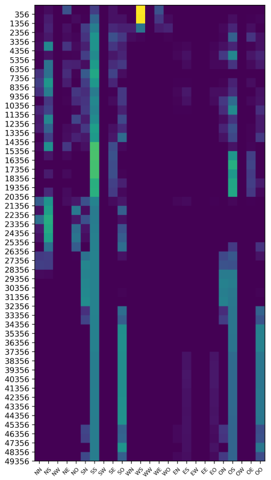
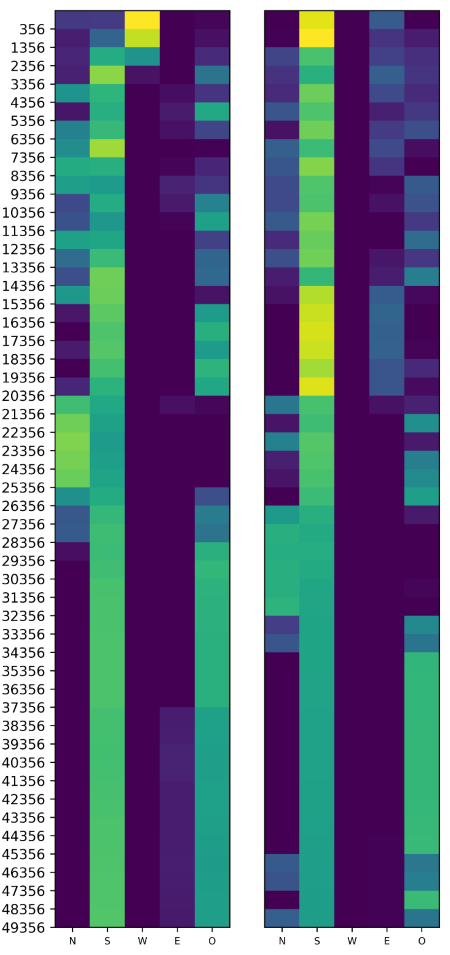
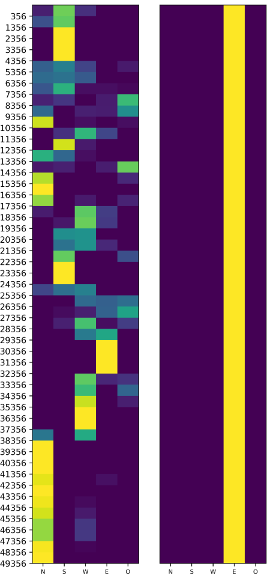

Requirements
------------

This project is coded in Python 3.6 under Windows and briefly tested on Linux. Required packages include Numpy, cvxopt and matplotlib. Executes

>pip3 install numpy matplotlib cvxopt

or

>pip3 install -r requirements.txt

Run All Agents
------------

Execute the following line to run all four agents. The q-value difference graphs and equilibrium color maps will be generated in the `results` folder.

>python3 exp_all.py

Run Individual Agent
------------

One may instead test each agent individually,

>python3 exp_ce-q.py

>python3 exp_foe-q.py

>python3 exp_friend-q.py

>python3 exp_q.py

Files \& Folders
------------

**soccer_evn.py**: implements the Soccer Game environment.

**q_common**: implements a base class for all type of q learners experimented.

**ce_q.py**, **foe_q.py**, **friend_q.py**, **mdp_q.py** implements the corresponding q learning models.

**exp_common.py**: common experiment logic and utilities.

**exp_ce-q.py**, **exp_foe-q.py**, **exp_friend-q.py**, **exp_q.py**, **exp_all.py**: experiment scripts

**prebuilt_seq.dat**: pre-built random episodes and initial ball ownerships.

**results**: contains raw data and figures used in the report; when running above experiment scripts, new data and figures will also be placed in this folder.

Graphs
-------------

Replication of q-value difference.

 

Equilibrium evolution of uCE-Q.

Equilibrium evolution of Foe-Q.

Equilibrium evolution of Friend-Q.

