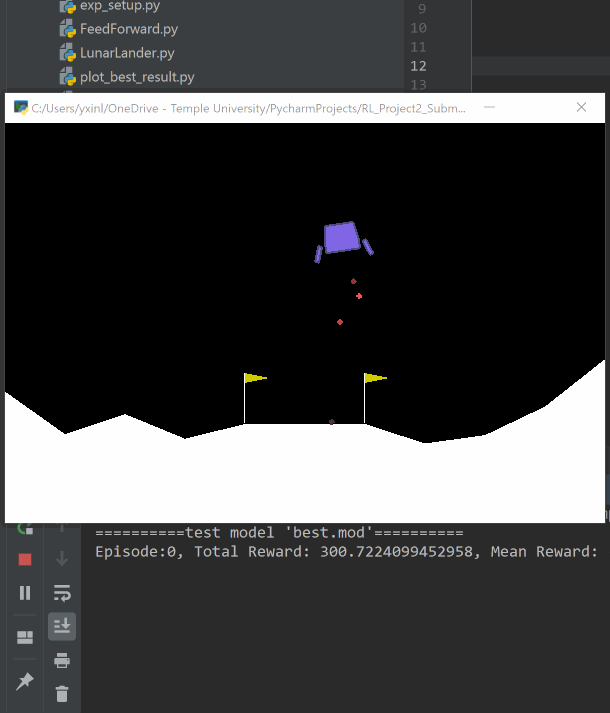

Requirements
------------

This project is coded in **Python 3.6** on Windows and tested on Mac. The primary required package is **PyTorch 1.0**. Please visit https://pytorch.org/, and it should be quick to find the command to install an appropriate version.

Other required packages include Numpy, Pandas and Matplotlib. For the later three requirements, run

>pip3 install numpy matplotlib pandas

or

>pip3 install -r requirements.txt

On Ubuntu 16.04, if getting error message "no module named _tkinter", then execute the following

>sudo apt-get install python3-tk

Run the best model
------------

Simply executes the `run.py` script. Our deep Q-learning model based on a two-hidden-layer feed forward network achieves **270+** points on average.  

>python3 run.py

Folders & figure reproduction
------------

The models and its training/test results are save in the `models` folder. I did the train/test experiments for almost **130** different network configurations. All trained models and results are saved here.

A sub-folder like `alpha`, `gamma` , `epsilon_xxx` saves data for a parameter tuning experiment. The sub-folder `netsize` is for the network selection experiments. The following scripts generate figures in my report using the experiment results. The figures are saved in the `plots` folder.

To reproduce Fig 1-2, execute 

>python3 plot_best_result.py

To reproduce Fig 3, execute

>python3 plot_net_selection.py

To reproduce hyper-parameter tuning figures Fig 4-8, execute

>python3 plot_hyper_para_tune.py

The script files, training and testing
------------

`FeedForward.py` implements a general feed-forward network using PyTorch. 

`QLearner.py` implements a general deep Q-learning algorithm (Algorithm 1 in the report). 

`LunarLander.py` further implements the lunar lander agent based on the deep Q-learning algorithm.

`exp_setup.py` has global experiment configurations.

`exp_net_select.py` runs the network selection experiments and also the experiment to see the effectiveness of experience replay.

`exp_para_tune.py` runs the hyper-parameter tuning experiments.

`exp_replay_mem.py` runs the the replay memory size and sample size tuning experiments. Due to time and space limit, this is only briefly described in the report.