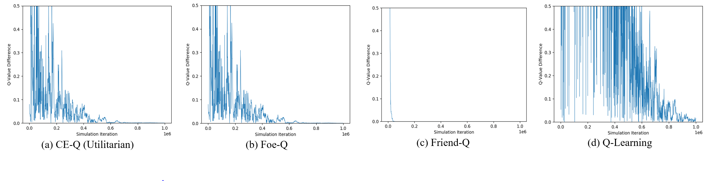

# RL-Projects

This repository contains three reinforcement learning course projects

[**Lunar Lander**](LunarLander): our deep Q-learning model achieves **280+** points on average for the Lunar Lander Problem, the highest score among those we can find online and reported in the class discussion board. Our paper-like report is here.

>

>

[**Correlated-Q**](CorrelatedQ): replicates the results in [Correlated-Q Learning](https://www.aaai.org/Papers/Symposia/Spring/2002/SS-02-02/SS02-02-012.pdf). In addition, we demo the equilibrium evolution.

> 

[**SuttonMDP**](SuttonMDP): replicates the results in [Learning to Predict by the Methods of Temporal Differences ](https://link.springer.com/content/pdf/10.1007/BF00115009.pdf). The same results are not easy to replicate as the paper is vague on the model's parameters. The right parmeter setup is found by repeatedly comparing the charts with the theory. 
